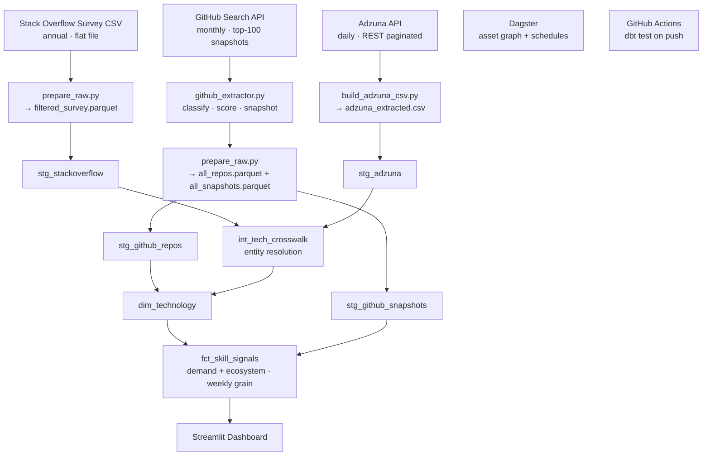

# Labor Market Intelligence

> Which skills are rising in real employer demand vs. rising in developer ecosystem hype?

A multi-source data engineering pipeline combining **Stack Overflow Developer Survey** (adoption baseline), **Adzuna** (employer demand), and **GitHub** (ecosystem signal) to surface early divergence between what employers want and what the developer community is building around.

## Live Dashboard
<!-- Add Streamlit link after deploy -->
> Deploy: `streamlit run dashboard/app.py` → Streamlit Community Cloud

## Architecture



## Stack & Why

| Tool | Why |
|---|---|
| **DuckDB / MotherDuck** | Analytical OLAP, serverless, free tier — no Postgres infra for a portfolio project |
| **dbt** | SQL transformations with tests, lineage, and documentation built in |
| **Dagster** | Asset-centric orchestration — models data as a graph of assets, not tasks. Correct mental model for a pipeline that materialises staged data assets |
| **Streamlit** | Fast dashboard iteration; Community Cloud free deploy |
| **GitHub Actions** | CI on dbt test so a broken model fails loudly on push, not silently in production |

Airflow was not chosen: it's task-centric, not asset-centric, and adds infra overhead that doesn't match the data volume here.

## Data Sources

| Source | Role | Cadence |
|---|---|---|
| SO Developer Survey 2024 | Technology adoption baseline (% of 48k respondents) | Annual |
| Adzuna India API | Employer demand (job postings, tech keyword match) | Daily |
| GitHub Search API | Ecosystem signal (Top-100 repos, quality classified) | Monthly |

**GitHub signal interpretation:** GitHub stars measure *developer attention around representative projects*, not adoption. A tech with 90 usable repos and 0.8 active ratio has a healthy, active ecosystem. A tech with 10 usable repos and 0.15 active ratio is either niche or stagnating. Stars alone mislead — hence median stars over mean, and top-5 concentration to detect when one project dominates.

## GitHub Extraction Design

Per `github_ecosystem_process.md`:
- **Top 100 repos per technology** (not 30 or 300 — 100 gives enough to classify and filter down to ~50-80 usable)
- **Quality classification**: `project` / `educational` / `collection` / `other` / `uncertain` — rule-based weighted scoring on name+description+topics. No README fetching, no commit inspection.
- **Relevance scoring**: independent from quality. A repo can be high-quality but low-relevance (e.g. AutoGPT counts towards Python ecosystem signal weakly).
- **Hard exclusions**: fork, archived, disabled — kept in raw but excluded from metrics.

## Entity Resolution

**Approach chosen: exact match on pre-validated crosswalk (tech_dimension_table.json).**

Rationale: SO Survey tech names are a known, closed set. The dimension table was built with manual overrides for edge cases (C++ → cpp, Node.js → nodejs, AWS → aws). For this dataset, exact matching on a pre-validated list produces zero confidently-wrong matches — the primary failure mode of fuzzy matching.

Fuzzy matching was considered and rejected: it would be appropriate for free-text Adzuna job *titles*, but the pipeline already keyword-matches at extraction time using the uppercase tech list, so the problem is pre-solved at source.

Unresolved technologies are kept with `is_unresolved = true` and surface in the dashboard — they are not silently dropped.

## Known Limitations

- **Data volume**: 1,788 Adzuna jobs across 3 pull dates. Not "scale" — sufficient for signal demonstration.
- **GitHub snapshot**: Single snapshot date (2026-09-05). Month-over-month trend metrics (`new_to_top100_ratio`) will populate after the second monthly run.
- **Entity resolution**: Emerging techs (LangChain, LangGraph etc.) are resolved via `emerging_tech.json` but may not appear in Adzuna keyword matches if job postings use different terminology.
- **Adzuna**: India-only postings. Global demand signal is not represented.

## Running Locally

```bash
# 1. Install deps
pip install -r requirements.txt

# 2. Set env vars
cp .env.example .env  # fill in GitHub token, Adzuna keys, MotherDuck token

# 3. Prepare raw data
python raw/adzuna/build_adzuna_csv.py
python raw/github/github_extractor.py
python raw/prepare_raw.py

# 4. Run dbt (local DuckDB)
dbt deps --profiles-dir dbt --project-dir dbt
dbt build --profiles-dir dbt --project-dir dbt

# 5. Dashboard
streamlit run dashboard/app.py
```

## CI

GitHub Actions runs `dbt test` on every push to `main` or `dev`. A broken model fails the build loudly.

## Project Structure

```
Labor-Market-Intelligence/
├── raw/
│   ├── stackoverflow/          # Survey CSV + filtered parquet
│   ├── adzuna/                 # JSON pulls + extracted CSV
│   ├── github/                 # Per-date repo JSONs + snapshots + parquets
│   │   ├── classifier.py       # Quality + relevance scoring
│   │   ├── snapshot.py         # Ecosystem metrics computation
│   │   ├── config.py           # Tunable weights
│   │   └── github_extractor.py # Main pipeline
│   ├── prepare_raw.py          # JSON → parquet consolidation
│   └── tech_dimension_table.json  # SO Survey → GitHub slug crosswalk
├── dbt/
│   ├── models/
│   │   ├── staging/            # One model per source
│   │   ├── intermediate/       # Entity resolution crosswalk
│   │   └── marts/              # dim_technology + fct_skill_signals
│   └── profiles.yml            # DuckDB dev / MotherDuck prod
├── dagster/
│   ├── assets/                 # raw_assets.py + dbt_assets.py
│   └── definitions.py          # Schedules + resources
├── dashboard/
│   └── app.py                  # Streamlit
└── .github/workflows/
    └── dbt_ci.yml
```
